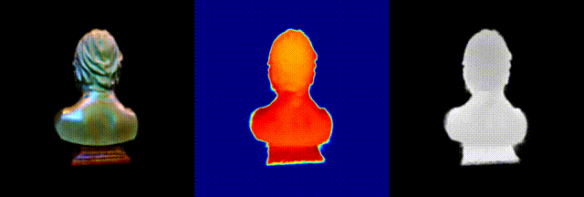

# GaussianDreamer: Fast Generation from Text to 3D Gaussian Splatting with Point Cloud Priors
### [Project Page](https://taoranyi.com/gaussiandreamer/) | [arxiv Paper](https://arxiv.org/abs/2310.08529)

[GaussianDreamer: Fast Generation from Text to 3D Gaussian Splatting with Point Cloud Priors](https://taoranyi.com/gaussiandreamer/)  

[Taoran Yi](https://github.com/taoranyi)<sup>1</sup>,
[Jiemin Fang](https://jaminfong.cn/)<sup>2‡</sup>,[Guanjun Wu](https://guanjunwu.github.io/)<sup>3</sup>,  [Lingxi Xie](http://lingxixie.com/)<sup>2</sup>, </br>[Xiaopeng Zhang](https://scholar.google.com/citations?user=Ud6aBAcAAAAJ&hl=zh-CN)<sup>2</sup>,[Wenyu Liu](http://eic.hust.edu.cn/professor/liuwenyu/)<sup>1</sup>, [Qi Tian](https://www.qitian1987.com/)<sup>2</sup> , [Xinggang Wang](https://xwcv.github.io/)<sup>1‡✉</sup>

<sup>1</sup>School of EIC, HUST &emsp;<sup>2</sup>Huawei Inc. &emsp; <sup>3</sup>School of CS, HUST &emsp; 

<sup>‡</sup>Project lead.  <sup>✉</sup>Corresponding author. 


In recent times, the generation of 3D assets from text prompts has shown impressive results. Both 2D and 3D diffusion models can generate decent 3D objects based on prompts. 3D diffusion models have good 3D consistency, but their quality and generalization are limited as trainable 3D data is expensive and hard to obtain. 2D diffusion models enjoy strong abilities of generalization and fine generation, but the 3D consistency is hard to guarantee. This paper attempts to bridge the power from the two types of diffusion models via the recent explicit and efficient 3D Gaussian splatting representation. A fast 3D generation framework, named as GaussianDreamer, is proposed, where the 3D diffusion model provides point cloud priors for initialization and the 2D diffusion model enriches the geometry and appearance. Operations of noisy point growing and color perturbation are introduced to enhance the initialized Gaussians. Our GaussianDreamer can generate a high-quality 3D instance within 25 minutes on one GPU, much faster than previous methods, while the generated instances can be directly rendered in real time.

## 🦾 Updates
- 10/16/2023: The rough code has been released, and there may still be some issues. Please feel free to raise issues. 


## 🏁 Get Started
**Installation**
Install [3D Gaussian Splatting](https://github.com/graphdeco-inria/gaussian-splatting) and [Shap-E](https://github.com/openai/shap-e#usage) as fellow:
```
conda install pytorch==2.0.1 torchvision==0.15.2 torchaudio==2.0.2 pytorch-cuda=11.7 -c pytorch -c nvidia
pip install ninja
pip install -r requirements.txt

git clone https://github.com/hustvl/GaussianDreamer.git 
cd GaussianDreamer

pip install ./gaussiansplatting/submodules/diff-gaussian-rasterization
pip install ./gaussiansplatting/submodules/simple-knn

git clone https://github.com/openai/shap-e.git
cd shap-e
pip install -e .
```
Download [finetuned Shap-E](https://huggingface.co/datasets/tiange/Cap3D/tree/main/our_finetuned_models) by Cap3D, and put it in `./load`

**Quickstart**
```
python launch.py --config configs/gaussiandreamer-sd.yaml --train --gpu 0 system.prompt_processor.prompt="a fox"
```


## 📑 Citation
If you find this repository/work helpful in your research, welcome to cite the paper and give a ⭐.
Some source code of ours is borrowed from [Threestudio](https://github.com/threestudio-project/threestudio), [3DGS](https://github.com/graphdeco-inria/gaussian-splatting), [depth-diff-gaussian-rasterization](https://github.com/ingra14m/depth-diff-gaussian-rasterization). We sincerely appreciate the excellent works of these authors.
```
@article{GaussianDreamer,
        title={GaussianDreamer: Fast Generation from Text to 3D Gaussian Splatting with Point Cloud Priors},
        author={Taoran Yi and Jiemin Fang and Guanjun Wu and Lingxi Xie and Xiaopeng Zhang and Wenyu Liu and Qi Tian and Xinggang Wang},
        journal={arxiv:2310.08529},
        year={2023}
        }
```
